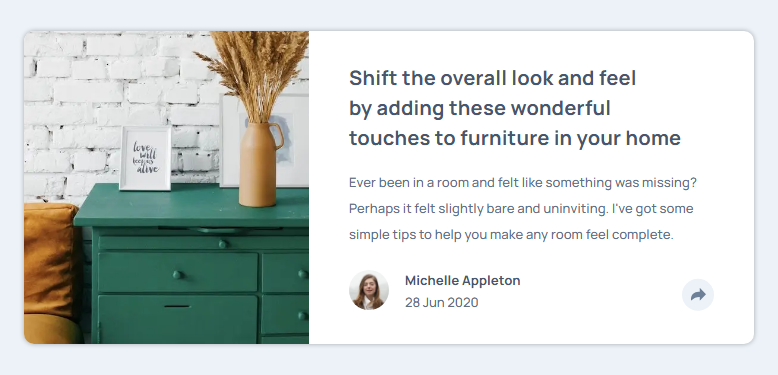

# Frontend Mentor - Article preview component solution

This is a solution to the [Article preview component challenge on Frontend Mentor](https://www.frontendmentor.io/challenges/article-preview-component-dYBN_pYFT). Frontend Mentor challenges help you improve your coding skills by building realistic projects.

### Screenshot

### Links

- [Solution](https://www.frontendmentor.io/solutions/article-previe-component-WFy4u1uGjk)
- [Live Site](https://zxjklp.github.io/article-preview-component-master/)

### Built With

- Semantic HTML5 markup
- CSS custom properties
- Flexbox
- CSS Grid
- Mobile-first workflow

## Author

- Frontend Mentor - [@Zxjklp](https://www.frontendmentor.io/profile/Zxjklp)
- GitHub - [@Zxjklp](https://github.com/Zxjklp)
